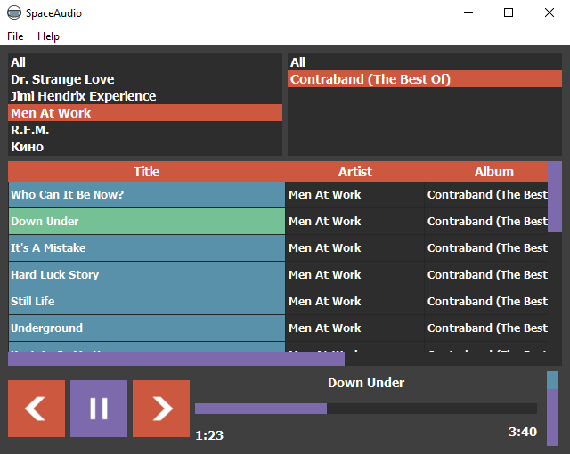

# Screenshot

# Releases
[https://github.com/Ohmnivore/SpaceAudio/releases](https://github.com/Ohmnivore/SpaceAudio/releases)

# Source code
[https://github.com/Ohmnivore/SpaceAudio](https://github.com/Ohmnivore/SpaceAudio)

# Supported formats
* .mp3
* .ogg
* .wav

# TODO (immediate)
* Open arbitrary files

# TODO (eventually)
* Force the directory tree to repaint on change
* Test on Linux and Mac
* QA test

# Source dependencies
* Python 32-bit (3.5.2)
* PyQt5 (5.6)
* pyglet (1.2.4)
* AVBin (10) binaries
* mutagen (1.3.4)
